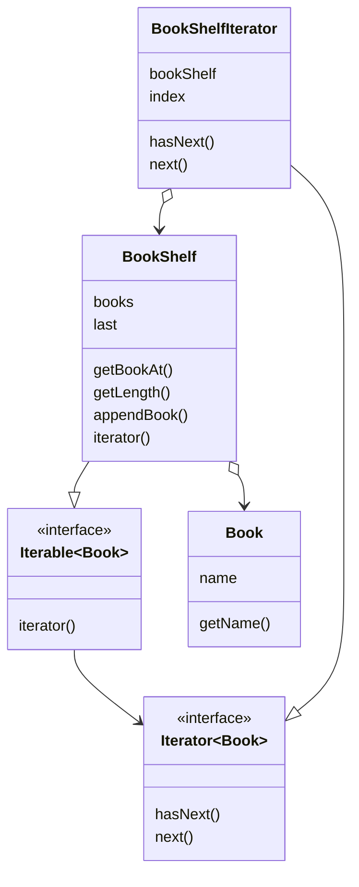

# 振る舞いに関するパターン

## Iterator

### 公式説明

集約オブジェクトが基にある内部表現を公開せずに、その要素に順にアクセスする方法を提供する。

### 解説

- 基本
- 詳細
- メリット

### クラス図

```mermaid
classDiagram
    class Iterable~Book~ {
        <<interface>>
        iterator()
    }

    class Iterator~Book~ {
        <<interface>>
        hasNext()
        next()
    }

    class BookShelf {
        books
        last
        getBookAt()
        getLength()
        appendBook()
        iterator()
    }

    class BookShelfIterator {
        bookShelf
        index
        hasNext()
        next()
    }

    class Book {
        name
        getName()
    }

    Iterable~Book~ --> Iterator~Book~
    BookShelf --|> Iterable~Book~
    BookShelfIterator --|> Iterator~Book~
    BookShelfIterator o--> BookShelf
    BookShelf o--> Book
```
